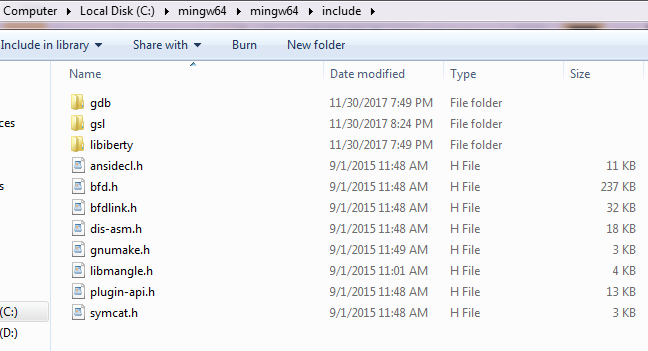

Multivariate Fox H-Function 

Version 1.2, April, 2018. 
This package includes both source and compiled MATLAB MEX routines for win64.

Changes
-------
Fast code using OpenMP-based parallel multi-thread computation.

Developed by
-------------

Hatim Chergui, Mustapha Benjillali and Mohamed-Slim Alouini

If you use this software or any (modified) part of it, please cite it as:

Hatim Chergui, Mustapha Benjillali and Mohamed-Slim Alouini, “Rician $K$-Factor-Based Analysis of XLOS Service Probability in 5G Outdoor Ultra-Dense Networks", [Online] Preprint available: arxiv.org

Contact email: chergui[at]ieee[dot]org

Download
--------

The package can be downloaded from https://github.com/HatimChergui/mfoxh

Content
-------

The package contains the following files:

1. mfoxh.c        : the main file including the MEX gateway function
2. mfoxfuncs.c    : including many functions used in the computation, such as the integrand definition, complex quasi-Monte-Carlo integration...
3. mfox.h         : header file
4. mfoxcontour.m  : a MATLAB function that calculates the complex multivariate integration contour using a fast linear programming algorithm.
5. mfoxh.mexwin64 : MEX routine that can be called from MATLAB win64 (see tests.m for examples).
6. tests.m        : Examples

MEX Build Instruction
---------------------

I. To recompile the source files for win64

1. Install GNU GSL library in a GSL_DIRECTORY of your choice (Directories with spaced names are not allowed in your full path. We recommend the installation of GSL in the mingw64 folder containing /include and /lib. In the below figure GSL_DIRECTORY = C:/mingw64/mingw64)

2. Change the extensions of the GSL files in GSL_DIRECTORY/lib from .a to .lib

3. A GSL bug fix: Open file GSL_DIRECTORY/include/gsl_complex.h and replace -> by . as in the following:

   #define GSL_REAL(z)     ((z).dat[0])
   
   #define GSL_IMAG(z)     ((z).dat[1])
   
   #define GSL_SET_COMPLEX(zp,x,y) do {(zp).dat[0]=(x); (zp).dat[1]=(y);} while(0)

4. Under MATLAB command line: 

   cd to the files directory
   
   mex -IGSL_DIRECTORY/include -LGSL_DIRECTORY/lib CFLAGS="$CFLAGS -fopenmp" LDFLAGS="$LDFLAGS -fopenmp" -llibgsl -llibgslcblas mfoxh.c mfoxfuncs.c

Tests
-----

Detailed test examples are available in tests.m.
