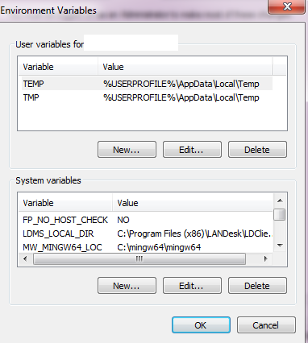
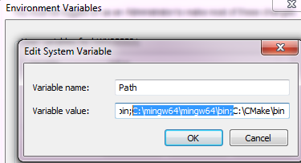
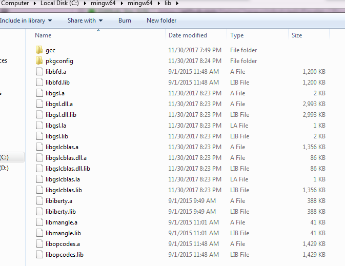

Multivariate Fox H-Function 

Version 1.2, April, 2018. 
This package includes both source and compiled MATLAB MEX routines for win64.

Changes
-------
Fast code using OpenMP-based parallel multi-thread computation.

Developed by
-------------

Hatim Chergui, Mustapha Benjillali and Mohamed-Slim Alouini

If you use this software or any (modified) part of it, please cite it as:

Hatim Chergui, Mustapha Benjillali and Mohamed-Slim Alouini, “Rician $K$-Factor-Based Analysis of XLOS Service Probability in 5G Outdoor Ultra-Dense Networks", [Online] Preprint available: https://arxiv.org/abs/1804.08101

Contact email: chergui[at]ieee[dot]org

Download
--------

The package can be downloaded from https://github.com/HatimChergui/mfoxh

Content
-------

The package contains the following files:

1. mfoxh.c        : the main file including the MEX gateway function
2. mfoxfuncs.c    : including many functions used in the computation, such as the integrand definition, complex quasi-Monte-Carlo integration...
3. mfox.h         : header file
4. mfoxcontour.m  : a MATLAB function that calculates the complex multivariate integration contour using a fast linear programming algorithm.
5. mfoxh.mexwin64 : MEX routine that can be called from MATLAB win64 (see tests.m for examples).
6. tests.m        : Examples

MEX Build Instruction
---------------------

To recompile the source files for win64:
1. Setup the environment:
- Download Mingw64
- Choose MingW 5.3 (compatible with MATLAB 2017b or mingW 64 4.9.2 compatible with Matlab 2017a)
- Choose x86_64 POSIX seh
- Install in c:\mingw64 (avoid folders with space such as Program Files),
- Add the folder C:/mingw64/mingw64/bin to PATH environment variable (EV),
- Add/set EV MW_MINGW64_LOC = C:/mingw64/mingw64/ (To let MATLAB detect the compilers).
 
    
 
2. To install msys: 
- Download msys
- Unzip it somewhere, for example C:\msys so that C:\msys\bin contains (among others) bash.exe.
- Doubleclick (or make a handy shortcut and run that) on C:\msys\msys.bat.
- Type: sh /postinstall/pi.sh
- Answer the friendly questions and you're all set up.

3. To install gsl correctly:
- From msys shell: cd to gsl folder:
- ./configure --prefix=C:/mingw64/mingw64 (the folder containg bin, include and lib folders
- make
- make install
- Change gsl .a libraries (libgsl.a, libgslcblas.a ...) extension to .lib to be detected by MATLAB

4. A GSL bug fix: 
Open file GSL_DIRECTORY/include/gsl_complex.h and replace -> by . as in the following:

#define GSL_REAL(z) ((z).dat[0])

#define GSL_IMAG(z) ((z).dat[1])

#define GSL_SET_COMPLEX(zp,x,y) do {(zp).dat[0]=(x); (zp).dat[1]=(y);} while(0)

5. To compile/link in one shot:

Under MATLAB command line, cd to the files directory and:
   
mex -IC:/mingw64/mingw64/include -LC:/mingw64/mingw64/lib CFLAGS="$CFLAGS -fopenmp" LDFLAGS="$LDFLAGS -fopenmp" -llibgsl -llibgslcblas mfoxh.c mfoxfuncs.c            

Tests
-----

Detailed test examples are available in tests.m.
